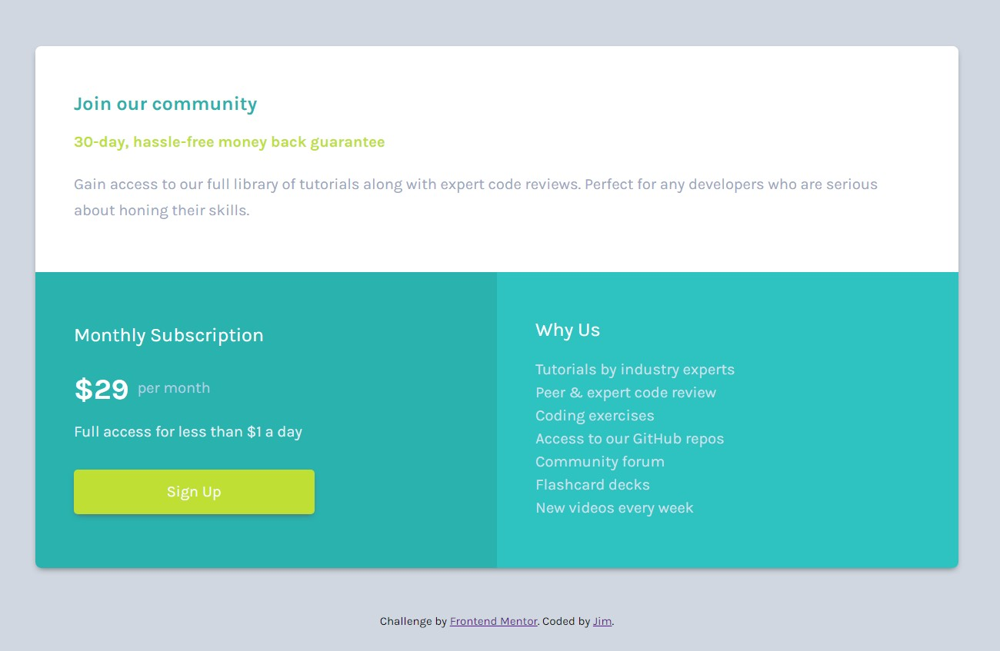

# Frontend Mentor - Single price grid component solution

This is a solution to the [Single price grid component challenge on Frontend Mentor](https://www.frontendmentor.io/challenges/single-price-grid-component-5ce41129d0ff452fec5abbbc). Frontend Mentor challenges help you improve your coding skills by building realistic projects.

這是[Single price grid component challenge on Frontend Mentor](https://www.frontendmentor.io/challenges/single-price-grid-component-5ce41129d0ff452fec5abbbc)的解答。  
Frontend Mentor challenges 是藉由實際建立專案，來改善你的 coding 的技術。

## Table of content 大綱

- [Overview（總覽）](#overview（總覽）)
  - [The challenge （關於這份挑戰）](#the-challenge（關於這份挑戰）)
  - [Screenshot （螢幕截圖）](#screenshot（螢幕截圖）)
  - [Links （網站連結）](#links（連結）)
- [My process （工作流程）](#my-process（工作流程）)
  - [Built with （使用的工具）](#built-with（使用的工具）)
  - [What I learned（我學到什麼）](#what-i-learned（我學到什麼）)
- [Author（關於作者）](#author（關於作者）)
- [Acknowledgments（致謝）](#acknowledgments（致謝）)

## Overview（總覽）

### The challenge（關於這份挑戰）

Users should be able to:

- View the optimal layout for the component depending on their device's screen size
- See a hover state on desktop for the Sign Up call-to-action

使用者應該要能夠：

- 根據手上的裝置螢幕尺寸來獲得最佳化的佈局
- 在電腦中滑鼠懸停狀態時有 "呼籲（CAT）" 的效果

### Screenshot（螢幕截圖）



### Links（連結）

- Live Site URL: [https://your-live-site-url.com](https://your-live-site-url.com)

## My process（工作流程）

### Built with（使用的工具）

- Mobile-first workflow
- Semantic HTML5 markup
- Flexbox

- [reset.css](https://meyerweb.com/eric/tools/css/reset/) - For style
- [box-shadow-generator](https://html-css-js.com/css/generator/box-shadow/) - For style

### What I learned（我學到什麼）

```css
.price_grid {
  width: 85%;
  min-width: 320px;
  max-width: 960px;
}
```

- `width: 85%`  
  To Make the element is fluid, so it can change its width following the window.

- `min-width: 320px`  
  To restrict the element's minimum width, (to prevent it's too small when on a small screen or resolution)

- `max-width: 960px`  
  To restrict the element's maximum width, (to prevent it's too big when on a large screen or resolution)

- `width: 85%`  
  讓容器變成是有流動（伸縮）的元素，能夠隨著螢幕寬度做變化。
- `min-width: 320px`  
  限制容器的最小寬度（避免當解析度過小時的問題）。
- `max-width: 960px`  
  限制容器的最大寬度（避免當解析度過大的問題）。

```css
.row {
  box-sizing: border-box;
  padding: 20px 30px 30px;
}
```

- `box-sizing: border-box`  
  Because we set padding to the element, so we have to change the calculation of box modal, and then it won't be overflow by its width from the container.

- `box-sizing: border-box`  
  由於這裡有設置`padding`，所以必須更改盒模型的計算方式，這樣子才不會有寬度溢出容器的問題。

```css
.row:nth-child(2) .price {
  display: inline-block;
  vertical-align: middle;
}
```

- `display: inline-block`  
  To make "$29" and "per month" side by side.
- `vertical-align: middle`  
  To make "$29" and "per month" center aligned.

- `display: inline-block`  
  讓"$29"，與 "per month"可以並排在一起。
- `vertical-align: middle`  
  讓"$29"，與 "per month"可以置中對齊。

```css
.btn {
  max-width: 250px;
}
```

- `max-width: 250px`  
  To restrict the button max-width, so it won't be scaled too
  large on desktop version.

- `max-width: 250px`，讓按鈕在桌機板畫面時不會被放得過大。

```css
@media screen and (min-width: 760px) {
  body {
    height: 100vh;
    display: flex;
    flex-direction: column;
    justify-content: center;
  }
}
```

For desktop, our goal is to set the component to the middle of the layout.  
So first we set `display: flex` to create a flex-box from body,  
and then we set `height: 100vh`, to make its height equal to viewport (by the browser window)  
and we use `flex-direction: column` and `justify-content: center` to implement our goal.  
(Change main-axis direction to column / make flex-item object can be center of main-axis from the flex-box.)

桌機版時，這裡要讓整個組件出現在螢幕的正中間。  
因此這裡先設定`display: flex`，將 body 設為一個 flex 空間，  
接著在設置`height: 100vh`，讓 body 容器的高等於可視範圍（瀏覽器視窗）
接著在透過`flex`中的`flex-direction: column`與`justify-content: center`來實現。  
（變更主軸的方向、使 flex 中的子物件對齊主軸中間的位置）

```css
@media screen and (min-width: 760px) {
  .price_grid {
    display: flex;
    flex-wrap: wrap;
  }
}
```

Because the default value of `flex-wrap` is `nowrap`, so we change it to `wrap`.  
So the flex-item in flex-box can be wrap now.

由於`flex-wrap`的預設值是`nowrap`，所以這裡更改為`wrap`，使得 flex 空間中的子物件能夠換行。

```css
@media screen and (min-width: 760px) {
  .row:nth-child(1) {
    flex-basis: 100%;
  }
}
```

It's for this:

為了這個：


```css
@media screen and (min-width: 760px) {
  .row:nth-child(2) {
    flex-basis: 50%;
  }
  .row:nth-child(3) {
    flex-basis: 50%;
  }
}
```

It's for this:

為了這個：


Additionally, because the default setting for flex-item will make them have the same height. so if we don't change the setting, it will seem not symmetrical by the view. like this:

另外，由於 flex 空間會讓子物件自動等高，所以如果沒有做調整的話，畫面看起來會沒有那麼對稱，像這樣：


If you still don't know what that means, you can the following test :

如果你還是不太理解為什麼會這樣的話，你可以在參考以下：

```css
@media screen and (min-width: 760px) {
  .price_grid {
    align-items: flex-start;
  }
}
```


To fix this problem, we can add the following code:

所以為了讓` .row:nth-child(2)`中的內容可以比較對稱，所以我們加上以下代碼：

```css
@media screen and (min-width: 760px) {
  .row:nth-child(2) {
    display: flex;
    flex-direction: column;
    justify-content: space-around;
  }
}
```

- `display: flex`  
  Create a flex-box.
- `flex-direction: column`  
  Change the direction of main axis to column.
- `justify-content: space-around`  
  Make flex-items are Equal spacing.

- `display: flex`  
  建立一個 flex 空間。
- `flex-direction: column`  
  更改 flex 的主軸方向。
- `justify-content: space-around`  
  讓 flex 空間中的子物件相等間距。

Finally, you finished it:

最後你就完成了這個：


Here is the last part. Call-To-Action effect for the sign-up button:

最後一個部分，按鈕的"呼籲（CAT）" 的效果：


```css
@media screen and (min-width: 760px) {
  .btn {
    transition: background-color 0.5s;
  }
  .btn:hover {
    background-color: hsl(71, 94%, 55%);
  }
}
```

## Author（關於作者）

- Website - [Jim's blog](https://jubeatt.github.io/)
- Frontend Mentor - [Jim](https://www.frontendmentor.io/profile/jubeatt)
- Facebook - [薛裕正](https://www.facebook.com/profile.php?id=100003593580513)

## Acknowledgments（致謝）

This is my first completion challenge of Frontend Mentor.  
Although it's just a small project, it reminds me of some skills I have learned before.  
I hope I could keep trying to finish the rest of the challenges in the future.

In the end, I want to say thank you to the author who created this platform.  
It helps people who are learning programs, just like me.

If you find anything wrong with this project or have any suggestions for me.please give me a reply by using the guestbook from Frontend Mentor or you can send me a [mail](mailto:jimdevelopesite) directly.

這是我第一個完成的 Frontend Mentor 挑戰。  
雖然只是個小專案，不過藉由這份練習，也讓自己複習了一些之前所學過的一些技巧。  
希望未來能繼續把每一個 Frontend Mentor 中的挑戰都陸續給完成。  
最後也很謝謝作者提供了 Frontend Mentor 這個平台，讓我們這些學習前端知
識的人可以藉此來練習自己的技巧，

如果你發現這份專案中有什麼錯誤的地方，或者是有什麼建議的話，都歡迎你利用 Frontend Mentor 的留言系統給我回饋，或者你也可以直接[寄信](mailto:jimdevelopesite)給我。
